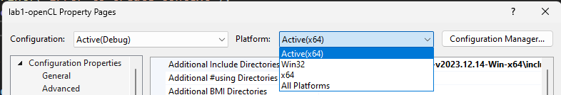
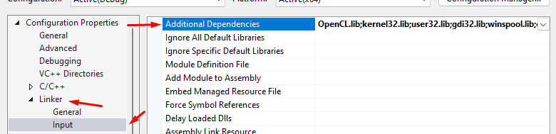

# Устновка OpenCL на домашний ПК на WIN 10-11 x64 и VisualStudio 2022

## 1. Скачивание бинарников OpenCL
Скачиваем оригинальный архив бинарников OpenCL: https://github.com/KhronosGroup/OpenCL-SDK/releases  
Проще всего скачать `OpenCL-SDK-v2023.12.14-Win-x64.zip` и распаковать в удобной вам папке.

## 2. Скачивание архива лабораторных работ
- Скачиваем архив с Yandex диска (ссылку можно найти в чатах)
- Скорее всего понадобиться установить Yandex диск на ПК, так как архив достаточно большой

## 3. Настройка проекта
1. Открываем папку `OpenCL-MPI-Docker-lab\lab1\lab1-openCL` и открываем проект `lab1-openCL.sln`.  
Предупреждение: если у вас не установлены инструменты разработки C++, то вам придется их докачать. Во время открытия проекта (vs выдаст предупреждение и даст предложение по установке) это займет около 1.5 гб (неточные данные) на скачивание и 6 гб на диске.
2. Меняем конфигурацию запуска платформ:  
  2.1 Меняем основную платформу:   
    
  2.2 Меняем конфигурацию запуска проекта:  
  
3. Указываем платформу инструментов для vs2022 (`v143`) (ранее там была указана vs2017, что не позволит запуститься проекту под vs2022):  

4. Настройка пустей к скачанному OpenCL  
  4.1 Насктройка подключаемых директорий:  
  В данном поле указываем слудующий путь к подключаемым дирректориям : `{your path...}\OpenCL-SDK-v2023.12.14-Win-x64\include`  
  
  4.2 Настройка подключаемых библиотек:  
  В данном поле указываем слудующий путь к подключаемым библиотекам : `{your path...}\OpenCL-SDK-v2023.12.14-Win-x64\lib`
  
5. Настройка дополнительных зависимостей:  
  После указания платформы в п. 2 в проекте затирается данная настройка дефолтным занчением, поэтому стоит ее восстановить, как было в изначальном проекте под x86 архитектурой.  
  Просто вставляем в поле `Additional Dependencies` слудующую строку: `OpenCL.lib;kernel32.lib;user32.lib;gdi32.lib;winspool.lib;comdlg32.lib;advapi32.lib;shell32.lib;ole32.lib;oleaut32.lib;uuid.lib;odbc32.lib;odbccp32.lib;%(AdditionalDependencies)`. Если интересно, можете поудалять лишние зависимости.  
  
6. Пробуем запустить проект, радуемся жизни

Если у Вас не запустилось, можете добавить PR/issue для данного файла и мы совместно поправим инструцию.
